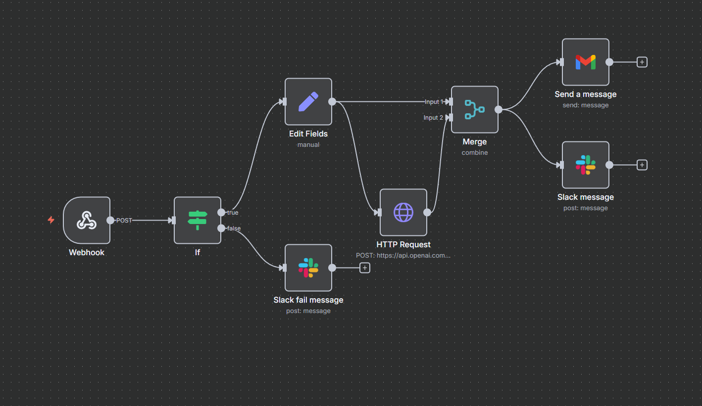

# 📨 OrderFlowAI

[](https://www.python.org/)  [](https://flask.palletsprojects.com/)    [](https://platform.openai.com/)   [](https://aws.amazon.com/) [](https://github.com/jkot16/order-flow-ai/actions/workflows/deploy.yml) [](https://www.docker.com/) [](https://developers.google.com/sheets/api)
   


  
> AI-powered, containerized system for order status checking, daily KPI reporting, and automated email/Slack notifications.  
> Integrates Google Sheets, a Flask web app, n8n workflows, Power Automate flows, and Python reporting scripts into a coordinated workflow, with the core application containerized and deployed on AWS EC2.


📚 **Table of Contents**
- 🔎 [Overview](#1-overview)
- 🛠️ [Features](#2-features)
- 📦 [Tech Stack](#3-tech-stack)
- 📊 [Core System: Google Sheets + Flask Web App](#4-core-system-google-sheets--flask-web-app)
- 🔔 [n8n Workflow – Order Status Notifications](#5-n8n-workflow--order-status-notifications)
- 📝 [Power Automate Workflow – Delayed Orders Report](#6-power-automate-workflow--delayed-orders-report)
- 📈 [KPI Report Script](#7-kpi-report-script)
- ⚙️ [CI/CD Pipeline](#8-cicd-pipeline)
- 🔐 [Security Practices](#9-security-practices)
- 💡 [Why this project matters](#10-why-this-project-matters)
- 🗺️ [Roadmap](#11-roadmap)

## 1. Overview

OrderFlowAI is a containerized AI-driven system for real-time order tracking, KPI reporting, and automated customer notifications.

This project was inspired by real-world logistics and customer service workflows. It combines AI assistants, process automation, and reporting – directly matching the skills and tools required in modern AI/ML-driven business analytics and RPA environments.

- **Google Sheets** acts as a simulated central company database with order data (`Order ID`, `Customer`, `Status`, `ETA`, `Email`).
- **Flask Web App** lets customers check order status in natural language, verifying both order ID and email.
- **Daily KPI Script** (`daily_report.py`) generates Excel reports summarizing order performance and sends them to Slack.
- **n8n Workflow** automatically sends AI-generated email updates to customers and Slack notifications to the team when order status changes.
- **Power Automate Flow** creates and sends PDF reports of delayed orders directly from Google Sheets.
- **CI/CD Pipeline** (GitHub Actions) builds and pushes Docker images to Amazon ECR, then deploys them to AWS EC2.
- **Dockerized Environment** ensures consistent deployment, with all dependencies packaged together.

This setup mirrors a production-like workflow where data is centralized, applications provide real-time access, and automation handles reporting, notifications, and deployment.

---


## 2. Features

- 💬 Natural language order status queries
- 🔍 Automatic extraction of order ID & email from free text
- 📄 Read-only data source in Google Sheets
- 🧠 AI-generated responses (empathetic for delays)
- 📊 Daily KPI Excel report with color-coded statuses
- 📣 Slack integration for daily summaries and error alerts
- 📧 AI-generated email notifications to customers (n8n + Gmail API)
- ⚙️ Power Automate PDF reports for delayed orders
- 🐳 Fully containerized deployment
- 🚀 CI/CD pipeline to AWS EC2

---

## 3. Tech Stack

| Tool / Service            | Purpose |
|---------------------------|---------|
| **Python 3.11 + Flask**   | Web server & `/ask` API logic |
| **OpenAI API (gpt-4o-mini)** | Extract OrderID/email, generate responses for chat & dedicated email notifications |
| **n8n**                   | Automated email & Slack notifications for order status updates |
| **Power Automate**        | Automated PDF report creation & email delivery |
| **gspread + Google Service Account** | Read-only connection to Google Sheets |
| **pandas / numpy**        | Data processing |
| **openpyxl**              | Styled Excel report generation |
| **requests**              | Sending reports to Slack |
| **python-dotenv**         | Environment variable management |
| **Docker**                | Application containerization |
| **Amazon ECR**            | Docker image registry |
| **Amazon EC2**            | Application hosting |
| **GitHub Actions**        | CI/CD: build → push → deploy |
| **Slack Webhook**         | KPI report & status change notifications |
| **Gmail API (OAuth2)**    | Sending AI-generated emails to customers |


---

## 4. Core System: Google Sheets + Flask Web App

1. User enters a question in the Flask UI, e.g. _"Where is my order 1001? Email: john.smith@example.com"_.
2. Backend extracts order ID and email (regex → AI fallback), validates the email, and suggests corrections for typos.
3. Data is fetched from Google Sheets via a read-only Service Account and loaded into Pandas.
4. If a matching order is found, AI generates a 2–4 sentence response based on order status and ETA.
5. Empathetic tone is applied if the order is delayed; a static message is used if AI is unavailable.

> Sample Google Sheet

  
---

## 5. n8n Workflow – Order Status Notifications

**File:** `automation/n8n/order_status_notify.json`

**Flow:**
- Trigger: HTTP Webhook (POST) with order data.
- Validate: Ensure all required fields are present and email is valid.
- Generate content: AI creates a concise, status-specific customer message.
- Send email: Gmail node sends the message to the customer.
- Notify Slack: Team receives an update with status-specific emoji.
- Error handling: Invalid payload triggers a Slack alert.

Used prompt:
```
Write 2–3 short sentences, polite and professional, adapting the tone to the status:
If new_status contains 'Delayed', apologise for the delay and express understanding.
If new_status contains 'Shipped' or 'In Transit', express happiness to inform them and appreciation for their patience.
For any other status, use a neutral informative tone.
End with: Kind regards,Customer Care Team"
```

**Setup:**
1. Import JSON into n8n.
2. Configure Gmail OAuth2, Slack API token, OpenAI API key.
3. Adjust Slack channel, webhook path, or prompt as needed.
4. Activate workflow.

> n8n workflow

  


> Customer e-mail notification

  

> Slack notification

  
---

## 6. Power Automate Workflow – Delayed Orders Report


**Flow:**
- Set PDF margins and fetch current date.
- Build export link from Google Sheets (A4, minimal margins).
- Open link in Chrome and wait for PDF generation.
- Email the PDF with the date in the subject line.

**Setup:**
1. Update `exportUrl` with your Sheet ID and GID.
2. Set the email recipient.
3. Ensure Gmail/Outlook and browser connectors are authorized.


> Power Automate flow


> Email with delayed orders to the team


> PDF


---

## 7. KPI Report Script

**File:** `scripts/daily_report.py`

**Flow:**
1. Reads orders from Google Sheets (read-only).
2. Calculates:
   - Total orders
   - % delayed
   - SLA misses
   - Status distribution
3. Generates `docs/daily_report.xlsx` with color-coded statuses.
4. Sends summary + report to Slack.

> Report


> Slack report


---

## 8. CI/CD Pipeline

- Creates ECR repo if it doesn’t exist.
- Builds and tags Docker image.
- Pushes image to ECR.
- SSH into EC2 → pulls image → runs container with `.env` and google sheets `credentials.json`.

---

## 9. Security Practices

- Google Sheets accessed in read-only mode.
- Secrets stored in GitHub Secrets.
- No hardcoded credentials.
- Minimal base images in Docker.

---

## 10. Why this project matters

 > OrderFlowAI delivers tangible value by combining AI, automation, and cloud-native deployment:

- **Enhanced customer experience** - AI-driven, empathetic communication keeps customers informed and engaged.
- **Operational efficiency** – Automated KPI reporting, email notifications, and status tracking reduce manual workload.
- **Production-ready architecture** – Containerized deployment with CI/CD ensures reliable, repeatable releases.
- **Cross-platform integration** – Google Sheets as the central hub, with Flask, n8n, Power Automate, Slack, and AWS working together within one coordinated workflow.

---

## 11. Roadmap
For more upcoming features and tracked improvements, see:  
👉 [GitHub Issues for OrderFlowAI](https://github.com/jkot16/order-flow-ai/issues)

